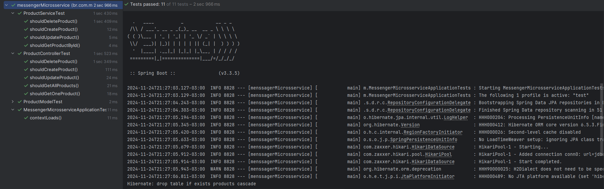
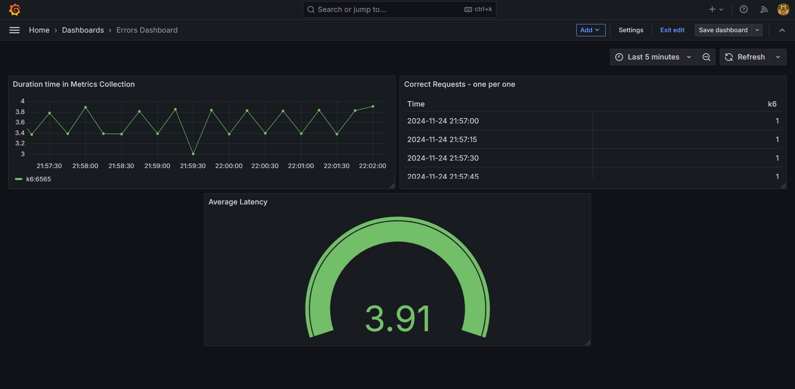

# Documentação de Testes na API

Esta documentação descreve a abordagem adotada para os testes realizados na API do projeto, destacando a importância, os objetivos e a execução dos testes unitários e de carga. Além disso, inclui exemplos e explicações detalhadas para garantir um entendimento completo.


## Testes Unitários

### **Objetivo dos Testes Unitários**
Os testes unitários garantem que cada componente individual da API funcione conforme o esperado. Eles ajudam a validar a funcionalidade de controladores, serviços e interações com o banco de dados, isolando partes específicas do sistema para identificar erros precocemente.

### **Descrição dos Testes Realizados**

#### **1. Testes de Controladores (`ProductControllerTest`)**
Estes testes verificam os **endpoints** da API, garantindo que eles retornem os resultados corretos para as requisições feitas.

- **Endpoints Testados**:
    - `/api/v1/products/listProducts`: Lista todos os produtos.
    - `/api/v1/products/getOneProduct`: Recupera um produto específico.
    - `/api/v1/products/createProduct`: Cria um novo produto.
    - `/api/v1/products/updateProduct`: Atualiza um produto existente.
    - `/api/v1/products/delete`: Exclui um produto.

- **Relevância**: Garante que os clientes da API recebam os dados corretos e que os endpoints estejam em conformidade com os requisitos de negócio.

- **Exemplo de Teste**:
```java
@Test
void shouldGetAllProducts() throws Exception {
    List<Product> products = Arrays.asList(product);
    when(productService.getAllProducts()).thenReturn(products);

    mockMvc.perform(get("/api/v1/products/listProducts")
                    .contentType(MediaType.APPLICATION_JSON))
            .andExpect(status().isOk())
            .andExpect(jsonPath("$.size()").value(1))
            .andExpect(jsonPath("$[0].name").value("Cadeira"));

    verify(productService, times(1)).getAllProducts();
}
```
**Explicação**: Simula uma requisição HTTP para listar produtos e verifica se a resposta contém os dados esperados, validando o funcionamento do endpoint.


#### **2. Testes de Serviços (`ProductServiceTest`)**
Estes testes avaliam a lógica de negócios implementada nos serviços da aplicação.

- **Objetivo**: Garantir que as regras de negócio sejam aplicadas corretamente, desde o mapeamento de DTOs até as operações de persistência.

- **Exemplo de Teste**:
```java
@Test
void shouldCreateProduct() {
    Product product = new Product();
    product.mapFromDto(createProductDTO);

    Mockito.when(productRepository.save(Mockito.any(Product.class))).thenReturn(product);

    Product savedProduct = productService.createProduct(createProductDTO);

    assertNotNull(savedProduct);
    assertEquals(createProductDTO.getName(), savedProduct.getName());
    assertEquals(createProductDTO.getPrice(), savedProduct.getPrice());
}
```
**Explicação**: Este teste cria um produto a partir de um DTO, verifica se os dados foram mapeados corretamente e garante que o serviço chamou o repositório para salvar o produto.


#### **3. Testes de Modelos (`ProductModelTest`)**
Estes testes validam a interação com o banco de dados, garantindo que as operações de persistência sejam realizadas corretamente.

- **Exemplo de Teste**:
```java
@Test
void shouldCreateAProduct() {
    Product savedProduct = productRepository.save(productTest);

    assertNotNull(savedProduct);
    assertEquals(productTest.getId(), savedProduct.getId());
}
```
**Explicação**: O teste salva um produto no repositório simulado e valida que os dados foram persistidos corretamente.

### **Resultados Obtidos**

Os testes apresentaram resultados excepcionais, alcançando 100% de validação em todas as funcionalidades, conforme demonstrado na imagem.  




## Testes de Carga com k6

### **Objetivo dos Testes de Carga**
Os testes de carga visam avaliar a capacidade da API de lidar com grandes volumes de requisições simultâneas, verificando:
- **Capacidade**: Quantas requisições o sistema suporta sem degradação significativa.
- **Escalabilidade**: Como o sistema se comporta ao ser escalado.
- **Estresse**: Ponto em que o sistema começa a apresentar falhas sob uma carga extrema.

### **Descrição do Teste**

Utilizamos o **k6**, uma ferramenta de código aberto para testes de desempenho, para simular usuários simultâneos acessando a API.

- **Cenário Testado**: O endpoint `/api/v1/products/listProducts` foi testado com 500 usuários simultâneos durante 30 segundos.

- **Exemplo de Script k6**:
```javascript
import http from 'k6/http';
import { check, sleep } from 'k6';

export const options = {
  stages: [
    { duration: '10s', target: 100 },
    { duration: '10s', target: 500 },
    { duration: '10s', target: 0 },
  ],
};

export default function () {
  const res = http.get('http://localhost:8080/api/v1/products/listProducts');
  check(res, {
    'status is 200': (r) => r.status === 200,
    'response time is < 200ms': (r) => r.timings.duration < 200,
  });
  sleep(1);
}
```

### **Resultados Esperados**
1. O endpoint deve responder com status 200 em todas as requisições.
2. O tempo de resposta médio deve permanecer abaixo de 200ms.
3. O sistema deve manter a estabilidade mesmo com o aumento de usuários.

### **Relevância**
- Avalia a **resiliência** da aplicação.
- Identifica gargalos de desempenho, permitindo ajustes antes de colocar o sistema em produção.
- Garante que a aplicação está pronta para lidar com o tráfego esperado.

### **Resultados Obtidos**

- Coleta de dados e realização de testes de desempenho em tempo real com visualização no Grafana e monitoramento no Prometheus, utilizando as métricas geradas pelo K6.


---

## Conclusão

Os testes unitários e de carga são complementares e críticos para o desenvolvimento de software:
- **Testes Unitários**: Asseguram que cada componente individual funcione corretamente.
- **Testes de Carga**: Avaliam a robustez e a escalabilidade do sistema como um todo.

Com ambos os tipos de testes implementados, garantimos a **qualidade**, **estabilidade** e **confiabilidade** da API, aumentando a confiança na entrega do produto final aos usuários.
